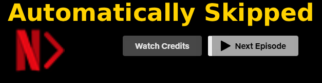
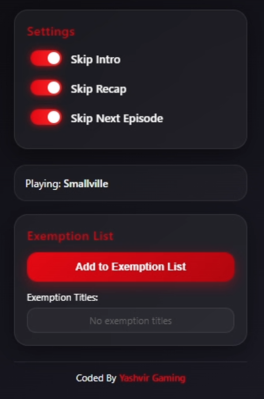

<h1 align="center">🎬 Netflix AutoSkip PRO</h1>

  <b>The Ultimate Netflix Automation Extension</b>

  Automatically skips <b>intros</b>, <b>recaps</b>, and <b>next episodes</b> — instantly and seamlessly.

  
  
  

  ⚡ Smart Detection &nbsp; • &nbsp; 🎯 Fully Automatic &nbsp; • &nbsp; 🌍 All Netflix Languages &nbsp; • &nbsp; 🔥 Premium UI

  

<h2>🚀 How It Works</h2>

<ol>
  <li>Install the extension</li>
  <li>Open or reload a Netflix tab</li>
  <li>Enjoy uninterrupted binge-watching 🎉</li>
</ol>

No setup. No configuration. Just works.

  

<h2>⭐ Support the Project</h2>

If this extension improves your Netflix experience:

<ul>
  <li>⭐ <b>Give it a Star</b></li>
  <li>📢 Share it</li>
  <li>🛠 Contribute</li>
</ul>

  <b>Your support helps improve features and performance.</b>

